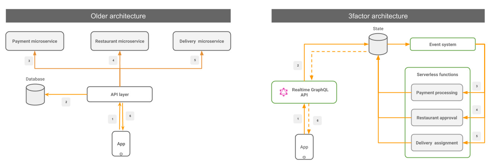

# 3factor

Today, it is possible to build backends for apps that allow for fast iteration, while being resilient and highly scalable from the get go. 

[We](https://hasura.io) propose an architecture pattern which is composed of 3 factors:

1. Realtime GraphQL
2. Event-driven
3. Async serverless

Consider a traditional food-delivery application which moves to a 3factor architecture:

## Realtime GraphQL: Iterate faster on your frontend

GraphQL APIs result in a much faster front-end developer workflow. In addition to speaking GraphQL, your API should also support the following 2 properties:

- **Low-latency**: An end-user should see [instant
  feedback](https://stackoverflow.com/a/164290/3364697) of an action and not
  have to wait on an API (<100ms ideal, upto 1 second at worst).
- **Support GraphQL subscriptions**: Consuming information
  asynchronously from the backend i.e a “realtime” GraphQL API. 
  
Refactor high-latency synchronous API responses to be reactive instead.

##### Example: 
*Instead of REST APIs, use GraphQL as much as possible to improve frontend app
development.* 

*Further, consider a naive GraphQL mutation to place an order (for a food-delivery application)
that would have executed a multi-step workflow or orchestrated microservices. This would have 
taken a longer time to respond and increased the chances of failure.*

*Refactor this to an `atomic` GraphQL mutation that just inserts an order and responds with an `order-id`. Update UI based on
realtime workflow updates (via subscriptions) to the `order-id`. The end user is confident that the order is placed and does not need complex error handling logic per request.*

## Event-driven: Make your backend resilient

Remove workflow and orchestration state from your backend APIs and persist them
into events. Your event system should have 2 properties:

- **Atomic**: Changes to the backend datastore, via GraphQL mutations or otherwise should
atomically emit events so that there is a guarantee that events are always created.
- **Reliable**: Events once emitted should be delivered atleast once. 

##### Example: 
*Instead of writing a `place-order` API endpoint (for a food-delivery application) that orchestrates
many upstream microservices by making API calls (like a workflow), emit events
for each state transition.*

*Your event system should deliver the events reliably to other microservices. This makes your application resilient to
transient failures because the event is persisted and can be retried without affecting the entire workflow.*

*It makes your application resilient to larger scale failures also because the
event system and your data store can easily be replicated across availability
zones making application recovery straightforward.*

## Async serverless: Scale your backend infinitely

Write business logic with serverless compute that is asynchronously triggered. 
This also mitigates the cold-start issue from causing slower perceived latency.

- Prepare for atleast-once: Your serverless business logic that is triggered by events
  might get triggered more than once. Try to write your code in a way where it doesn't 
  matter if it is triggered multiple times (idempotent) or add relevant checks.
- Modify state & trigger events: Your logic might cause a change in application state 
  and trigger more events.
- Communicate asynchronously: Communicate to the end-user app via changes in application state that can be consumed via GraphQL subscriptions.

This also allows for rapid iteration in the business logic without impacting the
GraphQL contract.

##### Example: 
*In your food ordering workflow, instead of writing a payment processing
microservice that captures different failure modes, write a payment processing
function that processes a payment or simply fails with an error code.*

*Suppose a payment fails, now you can insert a state/emit an event denoting failure with error code 1001. Now this event  invokes a serverless function specifically aimed at resolving this error.*

*This architecture encourages having smaller cohesive functions which do "atomic" work as much as possible.*

---------------------------------------------------------

A 3factor app requires you to remove state from your code and put it in your
datastore and in your event queues. Cloud vendors make it easy to scale and replicate
your datastore and event-queues. Making your business logic asynchronous requires a proportional 
investment in your realtime GraphQL API to allow the end-user app to consume asynchronous information easily. 

An interesting sidenote: A 3factor app's architecture is analogous to the [redux](https://redux.js.org/) dataflow
model on a react app, but applied to the fullstack.

##### Comparison to 12factor.net:
The 3factor name is inspired from 12factor.net. 12factor.net, created 7 years ago by the folks at Heroku, is a guide/methodology for creating isolated, portable microservices for modern cloud platforms. Although the name is similar, 3factor.app is actually an architectural pattern.

---

Written by [Tanmai Gopal](https://twitter.com/tanmaigo). This site is [open source](https://github.com/hasura/3factor). Contributions and ideas welcome.

